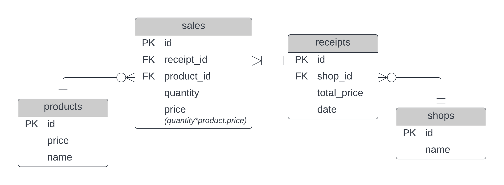

# Row vs. Column Database Comparison

## Description
This project is a part of Distributed Systems course. 
The goal of the project is to compare same queries on column-based and row-based databases.

**Used databases:**
- PostgresSQL on DigitalOcean (row-based)
- Oracle Autonomous Warehouse (column-based)

## ER Diagram



## Task

Встановити стовпчикову базу даних та реляційну базу даних.

Наповнити обидві бази даних згенерованими даними про купівлю товарів в магазині.

Зробити запити до обох баз даних та заміряти час відповіді:

1. Порахувати кількість проданого товару
2. Порахувати вартість проданого товару
3. Порахувати вартість проданого товару за період
4. Порахувати скільки було придбано товару А в мазазині В за період С
5. Порахувати скільки було придбано товару А в усіх магазинах за період С
6. Порахувати сумарну виручку магазинів за період С
7. Вивести топ 10 купівель товарів по два за період С (наприклад масло, хліб - 1000 разів)
```postgresql
select s.product_id as product_1, 
       s2.product_id as product_2, 
       count(*) as number_of_sales, 
       string_agg(s.receipt_id::varchar, ',') as receipts 
from sales s cross join sales s2
where s.receipt_id = s2.receipt_id 
	and s.receipt_id in (select id from receipts r where r."date"<'2022-04-03' and r."date">'2022-01-01')
group by s.product_id ,s2.product_id 
having s.product_id != s2.product_id 
order by number_of_sales desc
```
Problem, because for us (A,B) is same as (B,A), but cross join is about permutations, not combinations. Improved solution:
```postgresql
select s.product_id as product_1, 
       s2.product_id as product_2, 
       count(*) as number_of_sales, 
       string_agg(s.receipt_id::varchar, ',') as receipts 
from sales s join sales s2 on s.product_id < s2.product_id 
where s.receipt_id = s2.receipt_id 
	and s.receipt_id in (select id from receipts r where r."date"<'2022-12-31' and r."date">'2022-01-01')
group by s.product_id ,s2.product_id 
order by number_of_sales desc
fetch first 10 rows only;
```
9. Вивести топ 10 купівель товарів по три за період С (наприклад молоко, масло, хліб - 1000 разів)
```postgresql
select s.product_id as product_1, 
       s2.product_id as product_2, 
       s3.product_id as product_3,
       count(*) as number_of_sales, 
       string_agg(s.receipt_id::varchar, ',') as receipts 
from sales s join sales s2 on s.product_id < s2.product_id join sales s3 on s2.product_id < s3.product_id 
where s.receipt_id = s2.receipt_id and s2.receipt_id = s3.receipt_id 
	and s.receipt_id in (select id from receipts r where r."date"<'2022-12-31' and r."date">'2022-01-01')
group by s.product_id ,s2.product_id , s3.product_id 
order by number_of_sales desc
fetch first 10 rows only;
```
9. Вивести топ 10 купівель товарів по чотири за період С
```postgresql
select s.product_id as product_1, 
       s2.product_id as product_2, 
       s3.product_id as product_3,
       s4.product_id as product_4,
       count(*) as number_of_sales, 
       string_agg(s.receipt_id::varchar, ',') as receipts 
from sales s join sales s2 on s.product_id < s2.product_id join sales s3 on s2.product_id < s3.product_id join sales s4 on s3.product_id < s4.product_id 
where s.receipt_id = s2.receipt_id and s2.receipt_id = s3.receipt_id and s3.receipt_id = s4.receipt_id 
	and s.receipt_id in (select id from receipts r where r."date"<'2022-12-31' and r."date">'2022-01-01')
group by s.product_id ,s2.product_id , s3.product_id , s4.product_id 
order by number_of_sales desc
fetch first 10 rows only;
```

## Resources

### General
- [Bigtable: A Distributed Storage System for Structured Data](https://research.google/pubs/pub27898/)
- [Oracle Autonomous Data Warehouse – How It Works](https://www.youtube.com/watch?v=f4BurlkdEQM)
- [Oracle: Connect Python Applications with a Wallet (mTLS)](https://docs.oracle.com/en-us/iaas/autonomous-database-shared/doc/connecting-python-mtls.html)
- [List of Relational Column-oriented Databases](https://en.wikipedia.org/wiki/List_of_column-oriented_DBMSes)
- [Using python-oracledb 1.0 with SQLAlchemy, Pandas, Django and Flask](https://levelup.gitconnected.com/using-python-oracledb-1-0-with-sqlalchemy-pandas-django-and-flask-5d84e910cb19)
- [Connecting to Oracle Cloud Autonomous Database through SQLAlchemy](https://blogs.oracle.com/opal/post/connecting-to-oracle-cloud-autonomous-database-through-sqlalchemy)

#### HBase
- [Extract, Transform, and Load HBase Data in Python](https://www.cdata.com/kb/tech/hbase-python-petl.rst)
- [HappyBase](https://happybase.readthedocs.io/en/latest/user.html)
- [hbase-python](https://pypi.org/project/hbase-python/)
- [HBase with Java](https://www.baeldung.com/hbase)

**N.B.** Decided not to use HBase as it is not relational database.